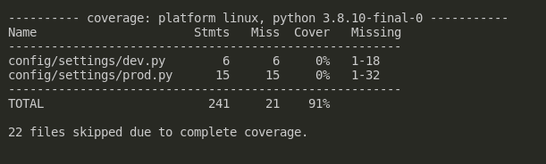

# Family Budget demo app

Sample family budget app I wrote for a job application.

## How I understood the task

1) Only Backend REST API is needed.
2) **Frontend of the app should contain the following pages:**

   1. Sign up page.
   2. Sign in page.
   3. Sign out page.
   4. Home page, for authenticated users, where:
      1. User sees a **paginated** list of all of their budgets.
      2. Each item in a list has:
         1. Name;
         2. "Share" button, that copies link to the budget;
         3. Create, edit and delete buttons.
      3. Paginator.
   5. Sharing is done by copying budget uuid — anybody can access budget's page.
   6. Budget page, that is accessible by any authenticated user.
      1. Displays budget's:
         1. Name;
         2. Incomes;
         3. Expenses by categories.
      2. Edit and delete buttons.
      3. Share button.
   7. Create budget page — only owner of the budget can access it.
      1. Contains a form for creating the budget.
      2. Save and Cancel buttons.
   8. Edit budget page — only owner of the budget can access it.
      1. Contains a form for editing the budget.
      2. Save and cancel buttons.

3) **Backend should have endpoints for:**

    1. signing up;
    2. signing in;
    3. signing out;
    4. retrieving a **paginated** list of budgets, **filtered** for the current authenticated user;
    5. retrieving a single budget by it's unique link by any authenticated user;
    6. creating a budget by any authenticated user;
    7. editing an existing budget by owner of the budget;
    8. deleting an existing budget by owner or the budget.
    9. CRUD-ing existing incomes, expenses, categories via endpoints.

### What I wrote

I've created the REST API backend for the application, with the aforementioned endpoints.

## Technologies

- Python;
- Django REST Framework;
- PostgreSQL;
- Docker;
- Docker-compose;
- Djoser for user endpoints;
- Pytest for tests;
- Caddy as reverse proxy and static files server.

## Test coverage

Test coverage is 91%.



## Installation

1. Rename `.env.example` to `.env`:

   ```shell
   cp .env.example .env
   ```

2. Change `USER_NAME=` and `USER_ID=` to your Linux/Mac user's username and id.

   - you can run `id` command to see the needed values.
   - docker won't be able to launch the app without them, because the docker
     container runs for local user, not for root user.

3. Start docker-compose: `sudo docker-compose up -d`.
4. Go to `/api/` url, you will see SwaggerUI page, where you can play with the api.
5. Go to `/admin/` url to access django-admin, demo credentials:

   - Login: `admin`;
   - Password: `demopass123`.

6. Enjoy.

## Local usage

### With `poetry`

1. Create virtual environment and install dependencies:

   ```shell
   poetry install
   ```

2. Activate virtual environment:

   ```shell
   poetry shell  
   ```

3. Set up environment:

   ```shell
   cp .env.example .env
   ```

4. Makemigrations and load fixtures:

   ```shell
   # devmanage.py — is manage.py that uses dev.py settings file
   python devmanage.py migrate  
   python devmanage.py loaddata fixtures/fixtures.json
   ```

5. Run local development server:

   ```shell
   python devmanage.py runserver
   ```

6. Run tests:

   ```shell
   pytest
   ```

## License

MIT
